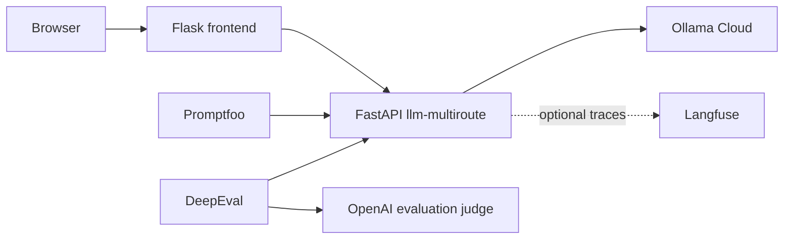
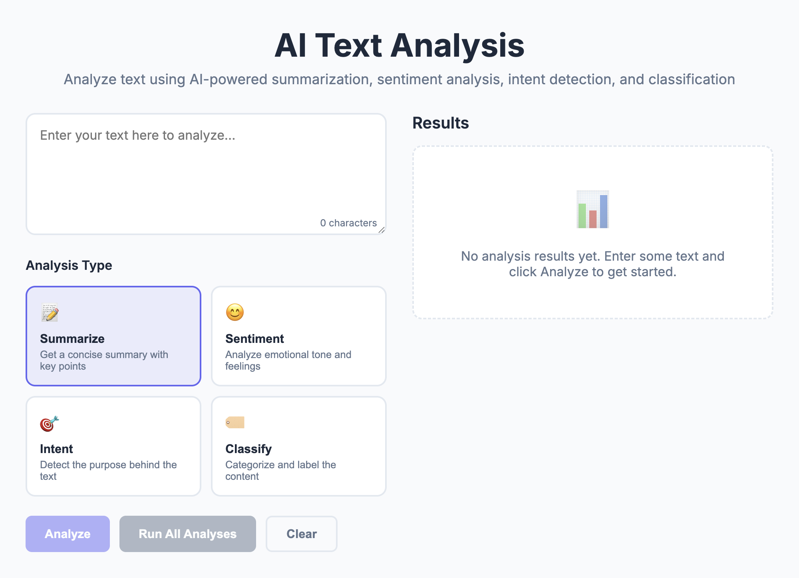
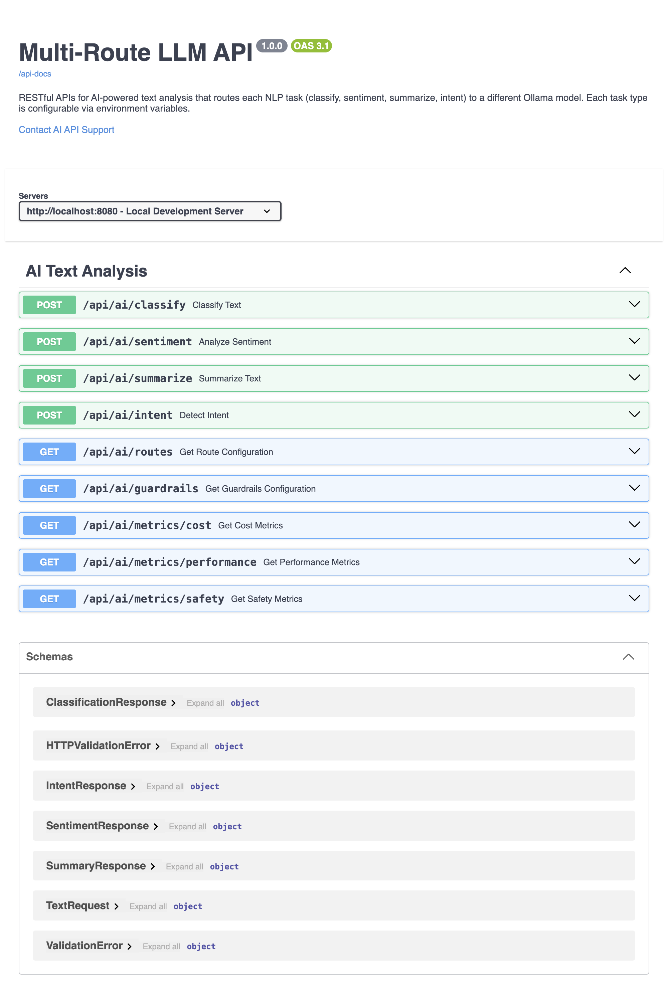
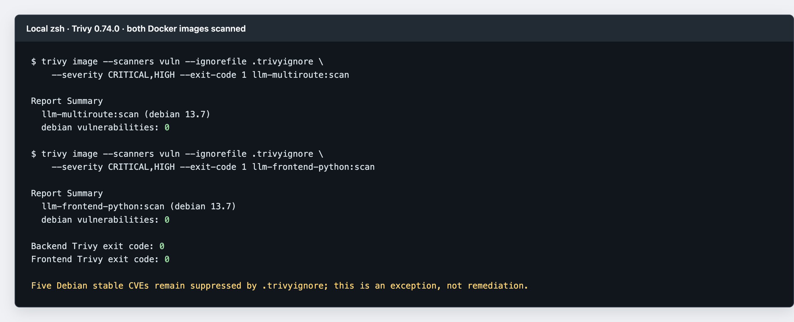
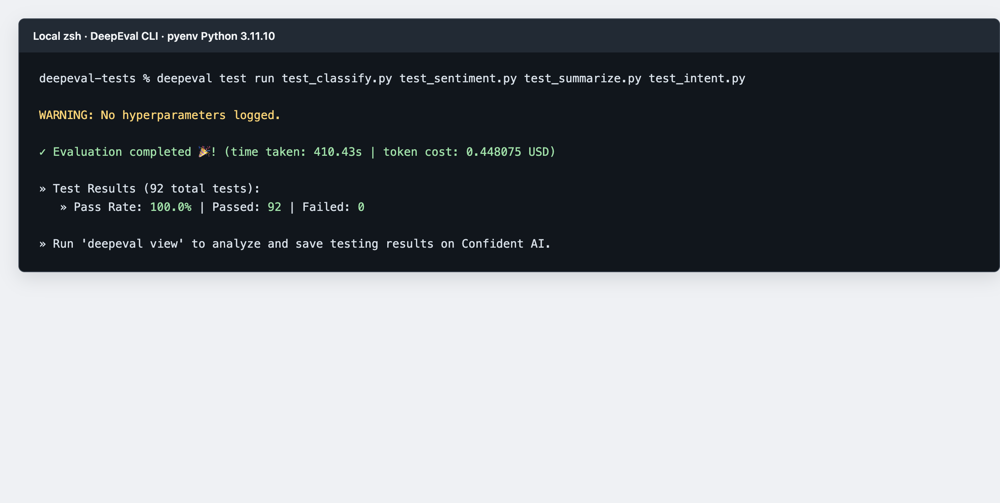
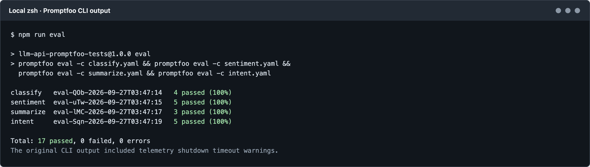

# LLM Applications and Evaluation

This repository contains Python services for LLM-powered text analysis, a web frontend, and automated evaluation suites. The APIs use Ollama; the DeepEval suite additionally uses OpenAI as its evaluation judge.

## Projects

| Directory | Purpose |
| --- | --- |
| `llm-python/` | FastAPI API using one configurable Ollama model across all analysis tasks. |
| `llm-multiroute/` | FastAPI API with per-task model routing, input/output guardrails, local metrics, and optional Langfuse tracing. |
| `llm-frontend-python/` | Flask frontend that sends analysis requests to a backend API. |
| `promptfoo-tests/` | Promptfoo checks for the four API endpoints. |
| `deepeval-tests/` | DeepEval quality evaluations using an LLM judge. |

## Architecture



`llm-python` is an alternative single-model backend; the Compose and Kubernetes frontend configurations use `llm-multiroute`.

## Run with Docker Compose

Requirements: Docker Compose and an Ollama API key.

Create a root `.env` file from the multiroute example and set `OLLAMA_API_KEY`:

```bash
cp llm-multiroute/.env.example .env
```

Then start the backend and frontend from the repository root:

```bash
docker compose up --build
```

Open the frontend at [http://localhost:5001](http://localhost:5001). The API listens at [http://localhost:8080](http://localhost:8080). Stop the services with `docker compose down`.

The Compose setup starts `llm-multiroute`. The alternative `llm-python` service also uses port 8080, so run only one backend on that port at a time.

## Local Development

The following commands select a Python interpreter with pyenv, create an isolated virtual environment, install the backend dependencies (including `guardrails-ai`), and start Uvicorn with the project `.env` file. Run them from the repository root:

```bash
cd llm-multiroute
pyenv local 3.11.10
python -m venv "$HOME/.venvs/llm-multiroute"
source "$HOME/.venvs/llm-multiroute/bin/activate"
python -m pip install -r requirements.txt
cp -n .env.example .env
```

Set `OLLAMA_API_KEY` in `llm-multiroute/.env`, then start the API:

```bash
uvicorn --env-file .env app.main:app --reload --port 8080
```

Uvicorn loads `.env` before importing the app, so settings and the Langfuse client can read those values during initialization. Keep `.env` private and do not replace an existing file containing local settings with the example.

## API Endpoints

The `llm-multiroute` API accepts JSON request bodies such as `{"text":"Analyze this text"}`.

| Method | Path | Operation |
| --- | --- | --- |
| `POST` | `/api/ai/classify` | Classify text |
| `POST` | `/api/ai/sentiment` | Analyze sentiment |
| `POST` | `/api/ai/summarize` | Summarize text |
| `POST` | `/api/ai/intent` | Detect intent |
| `GET` | `/api/ai/routes` | Show the configured model per task |
| `GET` | `/api/ai/guardrails` | Show active guardrail settings |
| `GET` | `/api/ai/metrics/cost` | View token and cost metrics |
| `GET` | `/api/ai/metrics/performance` | View request latency metrics |
| `GET` | `/api/ai/metrics/safety` | View safety events |

Interactive API documentation: [http://localhost:8080/swagger-ui.html](http://localhost:8080/swagger-ui.html).

## Guardrails and Monitoring

### Install and Configure

Guardrails is already a project dependency: `guardrails-ai>=0.10.2` is in [`llm-multiroute/requirements.txt`](llm-multiroute/requirements.txt). Installing the project's requirements installs it:

```bash
cd llm-multiroute
python -m pip install -r requirements.txt
```

The project implements its own local `guardrails-ai` validators in `app/guardrails/validators.py`. They are registered with `@register_validator` and wired together by `GuardrailsEngine` in `app/guardrails/engine.py`. No Guardrails Hub login, validator download, or additional API key is needed. These custom checks use regular expressions and heuristics; they are useful checks, not a complete security filter.

### Request and Response Flow

Every endpoint runs the request text through `guardrails_engine.check_input()` before making the Ollama call. The engine records detections, redacts matched secrets and PII, then either continues with sanitized text or raises a blocking error according to configuration. After the model responds, the service validates JSON against the endpoint's Pydantic response model. Invalid JSON, missing or wrongly typed fields, out-of-range values, or invalid enum values cause an error rather than a successful response.

By default, prompt-injection and harmful-content detections are logged but allowed through. Secrets are redacted and allowed through. PII is redacted and never blocked. To make detected prompt injection, harmful content, or secrets return HTTP 400, add the corresponding setting to `.env` and restart Uvicorn:

```env
GUARDRAILS_BLOCK_PROMPT_INJECTION=true
GUARDRAILS_BLOCK_HARMFUL_CONTENT=true
GUARDRAILS_BLOCK_SECRETS=true
```

For a local smoke test, use synthetic data only:

```bash
curl -X POST http://localhost:8080/api/ai/summarize \
	-H "Content-Type: application/json" \
	-d '{"text":"Please summarize this and email the result to demo@example.com"}'
curl http://localhost:8080/api/ai/metrics/safety
```

The email should be redacted before the request is sent to Ollama, and the safety metrics should record a PII detection. Inspect the effective blocking settings with `curl http://localhost:8080/api/ai/guardrails`. More examples are in [`llm-multiroute/metrics_testing.md`](llm-multiroute/metrics_testing.md).

Run the guardrail unit tests from `llm-multiroute/` to check detection, redaction, opt-in blocking, and output-schema validation without calling Ollama:

```bash
python -m pytest -q tests/test_guardrails.py
```

`llm-multiroute` checks user input before sending it to Ollama:

| Detection | Default behavior |
| --- | --- |
| Prompt injection | Record a safety event and continue; optionally block. |
| Harmful content | Record a safety event and continue; optionally block. |
| Secrets/API keys | Detect and redact before the model call; optionally block. |
| Personally identifiable information | Detect and redact before the model call; never block. |

Detected events are logged to the safety metrics store. Model output is validated against the task's Pydantic response schema, including required fields, data types, numeric ranges, and allowed enum values. Invalid output raises an error rather than being returned as a successful response.

Blocking is off by default. Set any of these variables to `true` to block that category:

```env
GUARDRAILS_BLOCK_PROMPT_INJECTION=true
GUARDRAILS_BLOCK_HARMFUL_CONTENT=true
GUARDRAILS_BLOCK_SECRETS=true
```

Use `GET /api/ai/guardrails` to inspect configured behavior and the metrics endpoints above to inspect cost, performance, and safety records. Example requests are in [metrics_testing.md](llm-multiroute/metrics_testing.md).

## Kubernetes

Kubernetes manifests are provided for the backend and frontend:

| Component | Manifest | Resources and network |
| --- | --- | --- |
| Backend | [`llm-multiroute/k8s/deployment.yaml`](llm-multiroute/k8s/deployment.yaml) | Namespace `llm-multiroute-backend`, one-replica Deployment, readiness/liveness probes, ConfigMap, Secret, and ClusterIP Service on port 8080. |
| Frontend | [`llm-frontend-python/k8s/deployment.yaml`](llm-frontend-python/k8s/deployment.yaml) | Namespace `llm-frontend`, one-replica Deployment, readiness/liveness probes, ConfigMap, and ClusterIP Service on port 5001. |

Before applying the backend manifest, populate its `llm-multiroute-secret` Secret with a base64-encoded `OLLAMA_API_KEY`. For example, encode a key already held in an environment variable with `printf '%s' "$OLLAMA_API_KEY" | base64`. Do not commit real credentials or a populated Secret manifest. Kubernetes Secret values are encoded, not inherently encrypted; secure access to the cluster and its secrets.

Apply both manifests from the repository root:

```bash
kubectl apply -f llm-multiroute/k8s/deployment.yaml
kubectl apply -f llm-frontend-python/k8s/deployment.yaml
```

Check deployment status:

```bash
kubectl get pods,deployments,services -n llm-multiroute-backend
kubectl get pods,deployments,services -n llm-frontend
```

Both Services are `ClusterIP`. To open the frontend locally, forward its service port:

```bash
kubectl port-forward -n llm-frontend service/llm-frontend-service 5001:5001
```

Then open [http://localhost:5001](http://localhost:5001). The frontend ConfigMap points to the backend Service's cluster DNS name. See the [backend](llm-multiroute/kubernetes_deployment.md) and [frontend](llm-frontend-python/kubernetes_deployment.md) deployment notes.

## Run Evaluations

Start the API first. Both evaluation suites send requests to the live API.

### Promptfoo

Install Promptfoo, for example with `brew install promptfoo`, then run from `promptfoo-tests/`:

```bash
npm run eval
```

Run an individual endpoint suite with `npm run eval:classify`, `npm run eval:sentiment`, `npm run eval:summarize`, or `npm run eval:intent`. Use `npm run view` to inspect Promptfoo results.

### DeepEval

Use two terminals. In Terminal 1, start the API with the pyenv-selected Python and load its local `.env` through Uvicorn:

```bash
cd llm-multiroute
pyenv local 3.11.10
uvicorn --env-file .env app.main:app --reload --port 8080
```

In Terminal 2, select the pyenv Python for DeepEval and install the test dependencies into that pyenv environment (no `.venv` is created):

```bash
cd deepeval-tests
pyenv local 3.11.10
python --version
python -m pip install -r requirements.txt
export OPENAI_API_KEY="your-openai-api-key"
```

Run all four suites:

```bash
deepeval test run test_classify.py test_sentiment.py test_summarize.py test_intent.py
```

Do not use pytest-xdist parallel workers (`-n 4`) with the current tests: they make live API calls while test modules are imported, which can cause duplicate requests, timeouts, and inconsistent collection.

## Verification and Evidence

Run the backend's unit tests from its project directory:

```bash
cd llm-multiroute
pytest -q
```

With the API running, verify the route and guardrail configuration and inspect safety events:

```bash
curl http://localhost:8080/api/ai/routes
curl http://localhost:8080/api/ai/guardrails
curl http://localhost:8080/api/ai/metrics/safety
```

For an end-to-end request, use the examples in [metrics_testing.md](llm-multiroute/metrics_testing.md), then run Promptfoo or DeepEval as described above.

### Screenshots and CI Run Evidence

The frontend and Swagger screenshots were captured from the locally running applications. DeepEval, Promptfoo, and Trivy images show local terminal CLI results. These CLI output panels are formatted excerpts, not raw terminal-window screenshots.

**Frontend**



**Multiroute Swagger UI**



**Local Trivy CLI: both images passed; zero unignored HIGH/CRITICAL findings**



**Local DeepEval CLI: serial run passed**



**Local Promptfoo CLI: 17 tests passed**



The local Promptfoo run passed 4 classify, 5 sentiment, 3 summarize, and 5 intent tests. The requested serial DeepEval CLI run passed all 92 tests (100%) in 410.43 seconds; DeepEval reported a token cost of approximately $0.45. The earlier parallel `-n 4` run timed out, but is not the result shown in the DeepEval screenshot. Both local Trivy scans passed with zero remaining HIGH/CRITICAL findings after applying `.trivyignore`. Five CVEs remain explicitly suppressed because Debian stable has no fixes listed; these are accepted exceptions, not remediated vulnerabilities. Do not include real keys or personal data in future screenshots.

## GitHub Actions CI/CD

The workflows run on pushes and pull requests to `main` or `master` when their listed paths change. Each also supports manual runs through **Actions → select workflow → Run workflow**. A change limited to the root README does not match the current path filters; use `workflow_dispatch` to run a workflow manually.

| Workflow | Runs when | Pipeline |
| --- | --- | --- |
| [`llm-multiroute-ci.yml`](.github/workflows/llm-multiroute-ci.yml) | `llm-multiroute/**`, `.trivyignore`, or its workflow changes | Ruff lint → pytest unit tests → build Docker image → Trivy scan → push image. |
| [`llm-frontend-python-ci.yml`](.github/workflows/llm-frontend-python-ci.yml) | `llm-frontend-python/**`, `.trivyignore`, or its workflow changes | Ruff lint → build Docker image → Trivy scan → push image. |
| [`promptfoo-tests-ci.yml`](.github/workflows/promptfoo-tests-ci.yml) | `promptfoo-tests/**`, `llm-multiroute/**`, or its workflow changes | Start backend with Docker Compose → wait for `/api/ai/routes` → run four Promptfoo suites sequentially → stop Compose. Uses Node.js 22. |
| [`deepeval-tests-ci.yml`](.github/workflows/deepeval-tests-ci.yml) | `deepeval-tests/**`, `llm-multiroute/**`, or its workflow changes | Install Python 3.12 dependencies → start backend with Docker Compose → wait for `/api/ai/routes` → run four DeepEval suites sequentially → stop Compose. |

Add workflow credentials in GitHub under **Settings → Secrets and variables → Actions**:

| Secret | Used by | Purpose |
| --- | --- | --- |
| `OLLAMA_API_KEY` | Promptfoo and DeepEval workflows | Authenticate requests to Ollama. |
| `OLLAMA_BASE_URL` | Promptfoo and DeepEval workflows | Set the Ollama API endpoint. |
| `OPENAI_API_KEY` | DeepEval workflow | Configure the LLM judge. |
| `DOCKERHUB_TOKEN` | Image publishing steps | Authenticate Docker Hub pushes on non-pull-request events. |

### Docker Image Trivy Scan

The two image workflows build a local `:scan` image, then run Trivy with table output. Findings of severity `CRITICAL` or `HIGH` fail the action (`exit-code: 1`). The scanner reads the root [`.trivyignore`](.trivyignore); review each ignored vulnerability regularly and remove suppressions when they are no longer justified. The scan runs for pull requests too, but Docker Hub login and image publishing are skipped for pull requests. On other events, publishing occurs only after lint/tests/build/scan succeed. To view details, open the GitHub Actions run and expand **Run Trivy vulnerability scanner**; the table reports vulnerability IDs, affected packages, severity, and available fixed versions.

Both Docker build contexts have `.dockerignore` files that exclude local `.env` files, Python virtual environments, caches, and Git metadata. This prevents developer credentials and host-installed packages from being copied into local images. Reproduce the build and scan from the repository root with:

```bash
docker build --pull -t llm-multiroute:scan -f llm-multiroute/Dockerfile llm-multiroute
docker build --pull -t llm-frontend-python:scan -f llm-frontend-python/Dockerfile llm-frontend-python
trivy image --scanners vuln --ignorefile .trivyignore --severity CRITICAL,HIGH --exit-code 1 llm-multiroute:scan
trivy image --scanners vuln --ignorefile .trivyignore --severity CRITICAL,HIGH --exit-code 1 llm-frontend-python:scan
```

As of this local run, both scans returned exit code `0`. The exceptions in `.trivyignore` suppress five findings still reported against Debian stable; do not interpret a passing scan as those upstream vulnerabilities being fixed.

## Configuration and Credentials

The multiroute backend reads `OLLAMA_API_KEY`, `OLLAMA_BASE_URL`, `OLLAMA_TEMPERATURE`, and per-task `OLLAMA_MODEL_*` settings from environment variables. The `llm-python` backend uses `OLLAMA_MODEL` for its single model. The Compose setup reads variables from the root `.env` file. Use `llm-multiroute/.env.example` as a starting point, then add your own credentials; never commit real API keys.

Langfuse tracing is optional. Configure `LANGFUSE_PUBLIC_KEY`, `LANGFUSE_SECRET_KEY`, and `LANGFUSE_HOST` to enable it. DeepEval requires an OpenAI API key for evaluation.

## Documentation

- [Docker setup](docker_readme.md)
- [CI workflows](workflow_readme.md)
- [Langfuse integration](langfuse.md)
- [Multiroute API details](llm-multiroute/readme.md)
- [Promptfoo instructions](promptfoo-tests/PROMPTFOO_INSTRUCTIONS.md)
- [DeepEval instructions](deepeval-tests/DEEPEVAL_INSTRUCTIONS.md)
